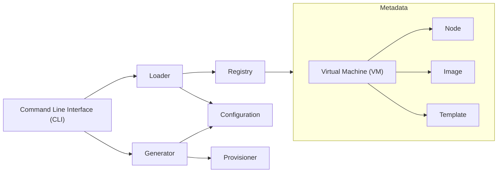

# Virtual Machine Provisioner for libvirt

A virtual machine provisioning script generator for [libvirt](https://libvirt.org/).

## Features

- Centralize all metadata about virtual machines.
- Generate independent provisioning scripts.
- Do not manage any state.

## Installation

Download [the latest release](https://github.com/t13a/vm-provisioner-libvirt/releases/latest).

```console
$ curl -LO https://github.com/t13a/vm-provisioner-libvirt/releases/latest/download/vmp
$ chmod a+x vmp
```

## Basic Usage

### Definition of the registry

Define the registry in YAML.

```console
$ vi registry.yaml
```

The following is a **minimum** description that defines the VM `vm1` that boots with [the live image of Alpine Linux](https://alpinelinux.org/downloads/) on [the local libvirt system mode daemon](https://libvirt.org/uri.html#qemu-qemu-and-kvm-uris).

```yaml
# registry.yaml
images:
  - name: alpine-virt
    tags:
      - pattern: ^(?P<major>\d+)\.(?P<minor>\d+)\.(?P<patch>\d+)$
        url: https://dl-cdn.alpinelinux.org/alpine/v{major}.{minor}/releases/x86_64/alpine-virt-{major}.{minor}.{patch}-x86_64.iso
        volumeName: alpine-virt-{major}.{minor}.{patch}-x86_64.iso
nodes:
  - name: localhost
    libvirt:
      connection:
        uri: qemu:///system
templates:
  - name: live
    provisioner: v1alpha1
    libvirt:
      domain:
        name: "{VM_NAME}"
        virtInstall:
          osinfo: linux2022
          disk:
            - name: live
              options:
                vol: "{DEFAULT_POOL_NAME}/{IMAGE_VOLUME_NAME}"
                format: "{IMAGE_FORMAT}"
                device: cdrom
          network:
            - name: default
              options:
                network: "{DEFAULT_NETWORK_NAME}"
      volumes:
        - name: "{IMAGE_VOLUME_NAME}"
          poolName: "{DEFAULT_POOL_NAME}"
          format: "{IMAGE_FORMAT}"
          deletionPolicy: Retain
          uploadFile:
            path: "{DEFAULT_IMAGE_DIR}/{IMAGE_VOLUME_NAME}"
vms:
  - name: vm1
    template: live
    nodeName: localhost
    image: alpine-virt:3.20.3
    libvirt:
      domain:
        virtInstall:
          memory: 2048 # 2 GiB
          vcpus: 2
```

### Provisioning the VM with live image

Generate the provisioner from the registry. The main script `Makefile` is created under the `vm1` directory.

```console
$ ./vmp gen < registry.yaml
Generated vm1/Makefile
```

Create and start the VM and enter the console. With the `-C` option, you can run the `vm1/Makefile` target without moving between directories. The `up` target is equivalent to `build` and `create` and `start`. To exit the console, press `Ctrl+]`.

```console
$ make -C vm1 up console
...
Welcome to Alpine Linux 3.20
Kernel 6.6.49-0-virt on an x86_64 (/dev/ttyS0)

localhost login: root
Welcome to Alpine!

The Alpine Wiki contains a large amount of how-to guides and general
information about administrating Alpine systems.
See <https://wiki.alpinelinux.org/>.

You can setup the system with the command: setup-alpine

You may change this message by editing /etc/motd.

localhost:~#
```

To stop and delete the VM, execute the following command. The `down` target is equivalent to `stop` and `delete` and `clean`.

```console
$ make -C vm1 down
...
```

## Advanced Usage

See `examples/advanced` directory, to learn the following usage.

- **Provisioning the VM with cloud image** (using [cloud-init `NoCloud` data source](https://cloudinit.readthedocs.io/en/latest/reference/datasources/nocloud.html))
- Using environment variables
  - `VMP_GEN_BASE_DIR`: To specify the base directory to generate
  - `VMP_REGISTRY`: To split the registry into multiple files
- More images and templates
- etc.

## Concepts



### Command Line Interface (CLI)

The command line interface (CLI) is named `vmp` and plays two roles. One is a **loader**, which loads configurations from the registry. The other is a **generator**, which generates a provisioner from the configuration.

### Registry

The registry aggregates all metadata about **virtual machines (VMs)**, including the **nodes** on which the VM runs, the **images** used as the VM's boot disk, and the **templates** that reuse the VM's metadata description. The term "node" comes from [the definition in libvirt](https://libvirt.org/goals.html).

The registry is written in YAML format and read from a single file or multiple files, or standard input. In describing metadata, "explicit" is preferred over "simple" in order to reduce ambiguity.

### Configuration

The configuration is a set of metadata about specific VM described in the registry. The loading of the configuration is deterministic. In the process of loading the configuration, node and image resolution, template merging, schema validation, and variable expansion are performed.

### Provisioner

The provisioner is a directory consisting of scripts and data, mainly `Makefile`. Execute the target in the `Makefile` to create or delete the VM, start or stop the VM, and connect to the console or SSH, etc.

The provisioner does not depend on CLI, registry, or configuration. Instead, it depends on common management commands such as `virsh` and `ssh`. Thus, even if the CLI stops working or the registry breaks in the future, the provisioner can continue to work as long as those commands are maintained.

The provisioner has a different versioning scheme than the CLI to maintain backward compatibility. For example, the provisioner `v1alpha1` is supported by the CLI `v0.1.0`. To describe provisioner-specific metadata in the registry, the version of provisioner must be specified (in the case of a variable, prefix it with `V1ALPHA1_`).
